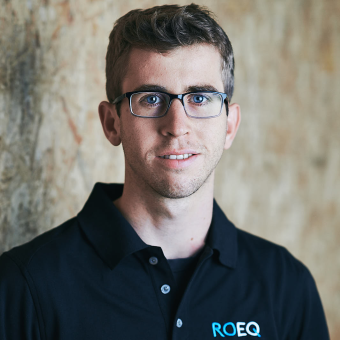

 
 

# Søren Holm-Petersen

   

I am a software developer interested in robotics, linux, embedded devices and software architechture / clean coding principles.

#### Employment history 
 * **Robotics Software Engineer at Universal Robots** *May 2022 - now*
    - Maintain and extend REST API for deploying custom applications (URCaps) on robots. Used golang and the docker engine API.
    - Handle DevOps tasks in robotics motion planning team.
    - Containerized development environment and dependencies using docker, jenkins and ansible to enable new devs. to get quickly up and running.
    - Maintained and sped up CI/CD pipelines by using ccache. 
    
 * **Software developer at Cobham SATCOM** *October 2020 - May 2022*
    - Developed a REST API in C++, which runs on an embedded linux platform. Data relating to a VSAT antenna can be fetched from the API.
    - Used C network programming to interface with satellite modems implementing the OpenAMIP protocol.
    - Written robust unit and integration tests using GoogleTest and pytest with a focus on TDD.
    - Deployed custom linux kernel and root filesystem onto targets using Buildroot.
    - Been part of a large software team, which uses scrum with daily standups, sprints and refinements.

* **Student assistant at ROEQ** *March 2018 - September 2018*
    - Wrote automated safety tests for mechanically modified mobile robots using python.
    - Interfaced with robots using their REST API and Robot Operating System.

#### Programming languages
C++, go, C, Python, bash, zsh, MATLAB, Typescript.

#### Tools / SDKs
git, gdb, CMake, gcc, clang, Qt, docker, Jenkins, gtest, ROS, Buildroot, vscode, vim, Bitbucket, Jira, angular.

#### Education
* B.Sc. robotics engineering *2015-2018* - University of Southern Denmark (SDU)
* M.Sc. robotics engineering *2018-2020* - SDU
* Master thesis on easy robot control through “Programming by Demonstration”.

#### Interests
Yoga, hiking, swimming, mountainbiking, playing football and german language/culture.